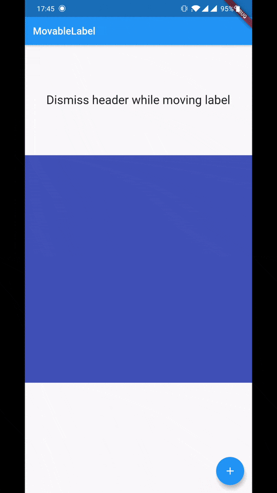

# flutter_movable_label

An interactive flutter widget to show labels.



## Installation

Add library dependency to your `pubspec.yaml`.

```yaml
dependencies:
  flutter_movable_label: ^1.0.1
```

## Import

```dart
import 'package:flutter_movable_label/flutter_movable_label.dart';
```

## Usage

// TODO


## Changelog

[CHANGELOG](./CHANGELOG.md)

## License

[MIT License](./LICENSE)